psidialogs (Python Simple Dialogs) is a wrapper
for different standard dialogs: 
 message, warning, error, ask_ok_cancel, ask_yes_no, ask_string, 
 ask_file, ask_folder, choice.


Links:
 * home: https://github.com/ponty/psidialogs
 * PYPI: https://pypi.python.org/pypi/psidialogs


back-ends:
 - [Zenity](https://en.wikipedia.org/wiki/Zenity)
 - [easygui](http://easygui.sourceforge.net/)
 - gMessage
 - [PyQt5](https://pypi.org/project/PyQt5/)
 - [PySide2](https://pypi.org/project/PySide2/)
 - [TkInter](https://docs.python.org/3/library/tkinter.html)
 - [wxPython](https://www.wxpython.org/)
 - [PythonDialog](https://pypi.org/project/pythondialog/)
 - console

# Installation

```console
$ python3 -m pip install psidialogs
```

Install all back-ends on Ubuntu 22.04:

```console
$ sudo apt-get install python3-tk
$ sudo apt-get install python3-pyqt5
$ sudo apt-get install python3-pyside2.qtwidgets
$ sudo apt-get install python3-dialog
$ sudo apt-get install python3-easygui
$ sudo apt-get install python3-wxgtk4.0
$ sudo apt-get install zenity
$ sudo apt-get install gxmessage
```

# Usage

```py
# psidialogs/examples/message.py

import psidialogs

psidialogs.message("Hello!")

```
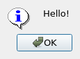  

```py
# psidialogs/examples/warning.py

import psidialogs

psidialogs.warning("Warning text.")

```
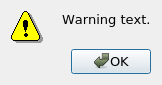  

```py
# psidialogs/examples/error.py

import psidialogs

psidialogs.error("Error text.")

```
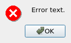  

```py
# psidialogs/examples/ask_ok_cancel.py

import psidialogs

ok = psidialogs.ask_ok_cancel("Do you want to continue?")
if ok:
    print("continue")

```
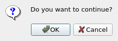  

```py
# psidialogs/examples/ask_yes_no.py

import psidialogs

yes = psidialogs.ask_yes_no("Yes or no?")
if yes:
    print("yes!")

```
  

```py
# psidialogs/examples/ask_string.py

import psidialogs

name = psidialogs.ask_string("What is your name?")
if name is not None:
    print(name)

```
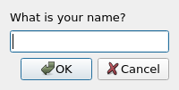  

```py
# psidialogs/examples/ask_file.py

import psidialogs

f = psidialogs.ask_file("Select a file!")
if f is not None:
    print(f)

```
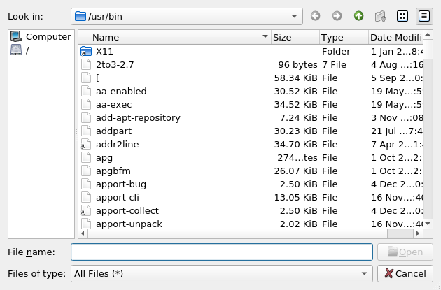  

```py
# psidialogs/examples/ask_folder.py

import psidialogs

f = psidialogs.ask_folder("Select a folder!")
if f is not None:
    print(f)

```
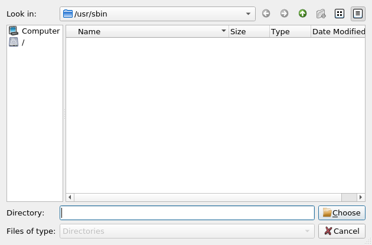  

```py
# psidialogs/examples/choice.py

import psidialogs

s = psidialogs.choice(["1", "2", "3"], "Choose a number!")
if s is not None:
    print(s)

```
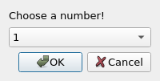  


The implemented backends can be listed, the order is the preference, which can be changed:
```py
# psidialogs/examples/backends.py

import psidialogs

print(psidialogs.backends())
psidialogs.set_backend_preference(["tkinter", "zenity"])
print(psidialogs.backends())

```
<!-- embedme doc/gen/python3_-m_psidialogs.examples.backends.txt -->
```console
$ python3 -m psidialogs.examples.backends
['pyside2', 'tkinter', 'zenity']
['tkinter', 'zenity', 'pyside2']
```


Changing the backend preference:
```py
# psidialogs/examples/set_backend_preference.py

import psidialogs

psidialogs.set_backend_preference(["tkinter", "zenity"])
psidialogs.message("Hello!")

```
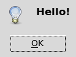  


# Demo

<!-- embedme doc/gen/python3_-m_psidialogs.examples.demo.txt -->
All backends and all dialog types can be tested with the demo:
```console
$ python3 -m psidialogs.examples.demo
```
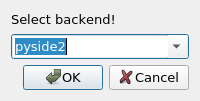  

<!-- embedme doc/gen/python3_-m_psidialogs.examples.demo_--backend_zenity.txt -->
The demo can be started with one backend:
```console
$ python3 -m psidialogs.examples.demo --backend zenity
```
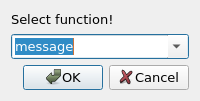  

<!-- embedme doc/gen/python3_-m_psidialogs.examples.demo_--backend_zenity_--dialogtype_message.txt -->
The demo can be started with one backend and one dialog type:
```console
$ python3 -m psidialogs.examples.demo --backend zenity --dialogtype message
```
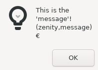  

<!-- embedme doc/gen/python3_-m_psidialogs.examples.demo_--help.txt -->
Demo full help:

```console
$ python3 -m psidialogs.examples.demo --help
usage: demo.py [-h] [-b BACKEND] [-d DIALOGTYPE] [-t TITLE] [--debug]

optional arguments:
  -h, --help            show this help message and exit
  -b BACKEND, --backend BACKEND
  -d DIALOGTYPE, --dialogtype DIALOGTYPE
  -t TITLE, --title TITLE
  --debug               set logging level to DEBUG
```

# Screenshots

Screenshots are created on Ubuntu 22.04 server with Xvfb.

Versions:
<!-- embedme doc/gen/python3_-m_psidialogs.check.versions.txt -->

```console
$ python3 -m psidialogs.check.versions
python               3.8.10
psidialogs           0.2.0
pyside2              5.14.0
tkinter              8.6
zenity               3.32.0
```

 ## message(), warning(), error() 

|      backend | message                               | warning                               | error                               |
| -----------: | ------------------------------------- | ------------------------------------- | ----------------------------------- |
|       zenity | 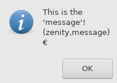       | 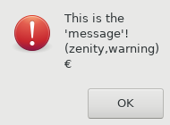       | 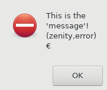       |
|     gmessage | 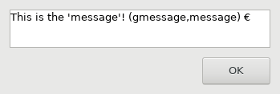     |      | 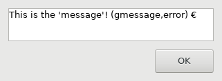     |
|     wxpython | 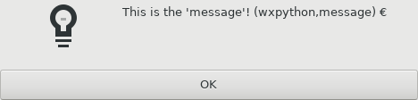     | 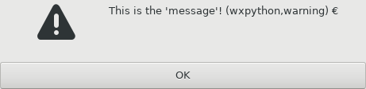     | 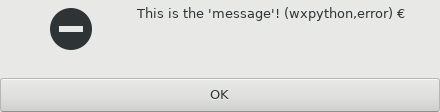     |
|      tkinter | 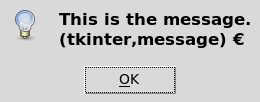      | 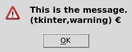      | 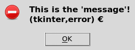      |
|      easygui | 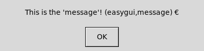      | 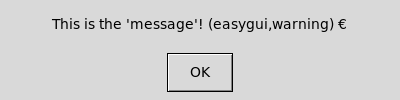      |       |
|        pyqt5 | 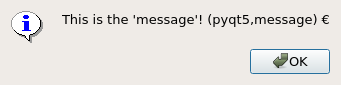        | 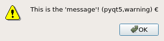        | 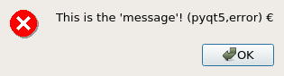        |
|      pyside2 | 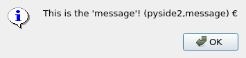      |       | 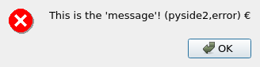      |
| pythondialog |  | 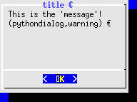 | 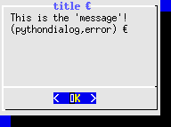 |
|      console |       |       |       |

## ask_ok_cancel(), ask_yes_no(), ask_string()

|      backend | ask_ok_cancel                               | ask_yes_no                               | ask_string                               |
| -----------: | ------------------------------------------- | ---------------------------------------- | ---------------------------------------- |
|       zenity | 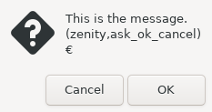       |        | 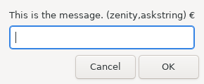       |
|     gmessage | 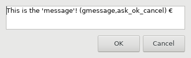     | 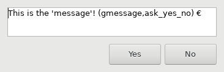     | 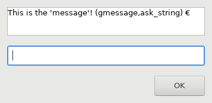     |
|     wxpython | 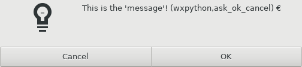     | 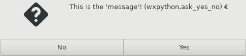     | 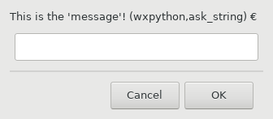     |
|      tkinter | 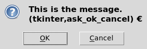      | 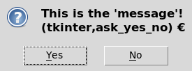      | 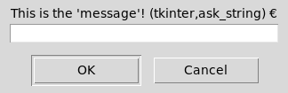      |
|      easygui | 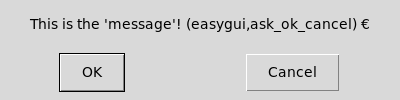      | 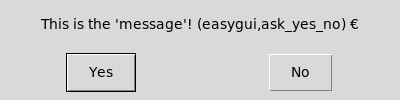      | 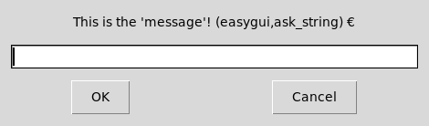      |
|        pyqt5 | 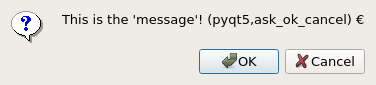        | 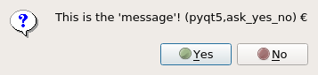        | 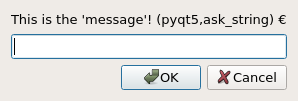        |
|      pyside2 | 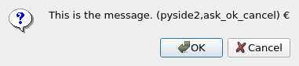      |       |       |
| pythondialog |  |  |  |
|      console |       |       |       |

## ask_file(), ask_folder()

|      backend | ask_file                               | ask_folder                               |
| -----------: | -------------------------------------- | ---------------------------------------- |
|       zenity |        |        |
|     gmessage |      |      |
|     wxpython |      |      |
|      tkinter |       |       |
|      easygui |       |       |
|        pyqt5 |         |         |
|      pyside2 |       |       |
| pythondialog |  |  |
|      console |       |       |

## choice()

|      backend | choice                               |
| -----------: | ------------------------------------ |
|       zenity |        |
|     gmessage |      |
|     wxpython |      |
|      tkinter |       |
|      easygui |       |
|        pyqt5 |         |
|      pyside2 |       |
| pythondialog |  |
|      console |       |

Hierarchy
=========


